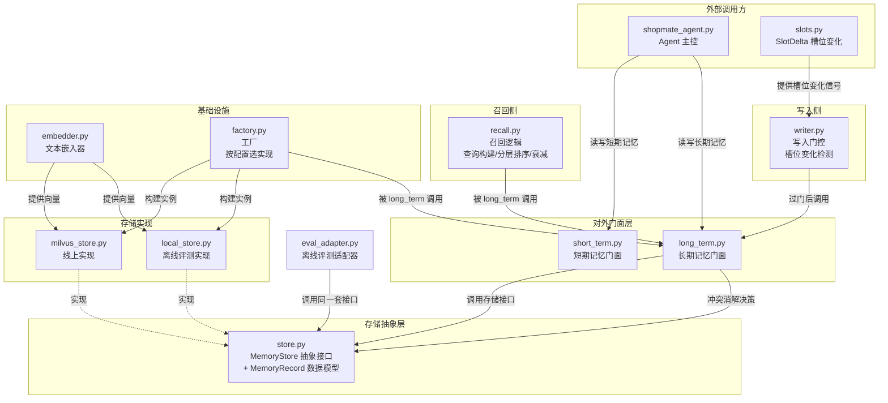

# 记忆系统

```mermaid
flowchart TB
    subgraph 对外门面层
        STM[short_term.py<br/>短期记忆门面]
        LTM[long_term.py<br/>长期记忆门面]
    end

    subgraph 写入侧
        WRITER[writer.py<br/>写入门控<br/>槽位变化检测]
        WRITER -->|过门后调用| LTM
    end

    subgraph 召回侧
        RECALL[recall.py<br/>召回逻辑<br/>查询构建/分层排序/衰减]
        RECALL -->|被 long_term 调用| LTM
    end

    subgraph 存储抽象层
        STORE[store.py<br/>MemoryStore 抽象接口<br/>+ MemoryRecord 数据模型]
    end

    subgraph 存储实现
        MILVUS[milvus_store.py<br/>线上实现]
        LOCAL[local_store.py<br/>离线评测实现]
        MILVUS -.实现.-> STORE
        LOCAL -.实现.-> STORE
    end

    subgraph 基础设施
        EMBED[embedder.py<br/>文本嵌入器]
        FACTORY[factory.py<br/>工厂<br/>按配置选实现]
    end

    subgraph 外部调用方
        AGENT[shopmate_agent.py<br/>Agent 主控]
        SLOTS[slots.py<br/>SlotDelta 槽位变化]
    end

    %% 门面 ↔ 外部
    AGENT -->|读写短期记忆| STM
    AGENT -->|读写长期记忆| LTM
    SLOTS -->|提供槽位变化信号| WRITER

    %% 门面 ↔ 存储
    LTM -->|调用存储接口| STORE
    LTM -->|冲突消解决策| STORE

    %% 工厂 ↔ 实现
    FACTORY -->|构建实例| MILVUS
    FACTORY -->|构建实例| LOCAL
    FACTORY -->|被 long_term 调用| LTM

    %% 嵌入器 ↔ 存储
    EMBED -->|提供向量| MILVUS
    EMBED -->|提供向量| LOCAL

    %% 评测
    EVAL[eval_adapter.py<br/>离线评测适配器]
    EVAL -->|调用同一套接口| STORE
```
